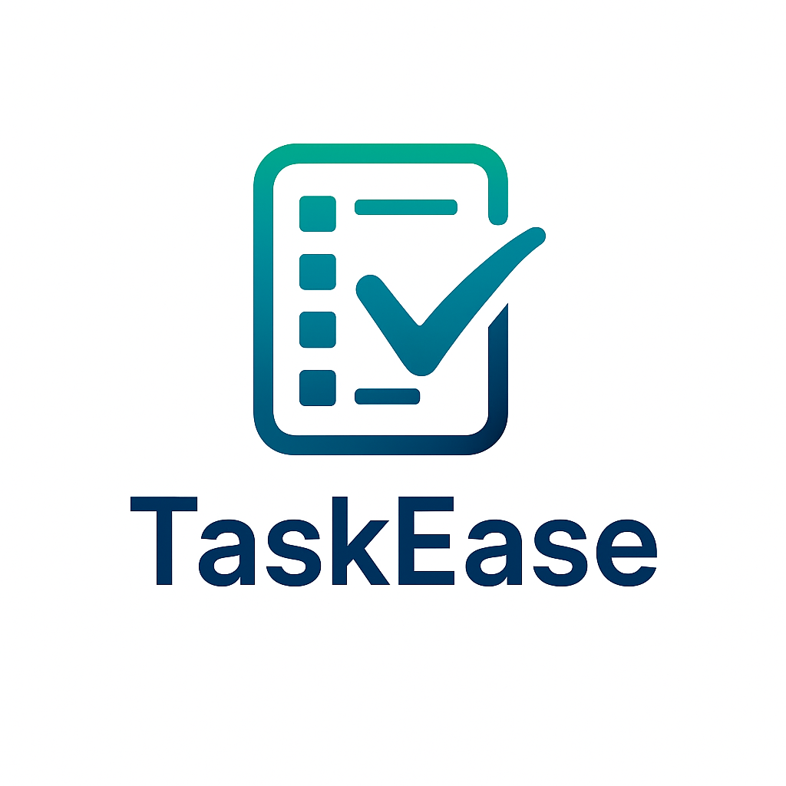
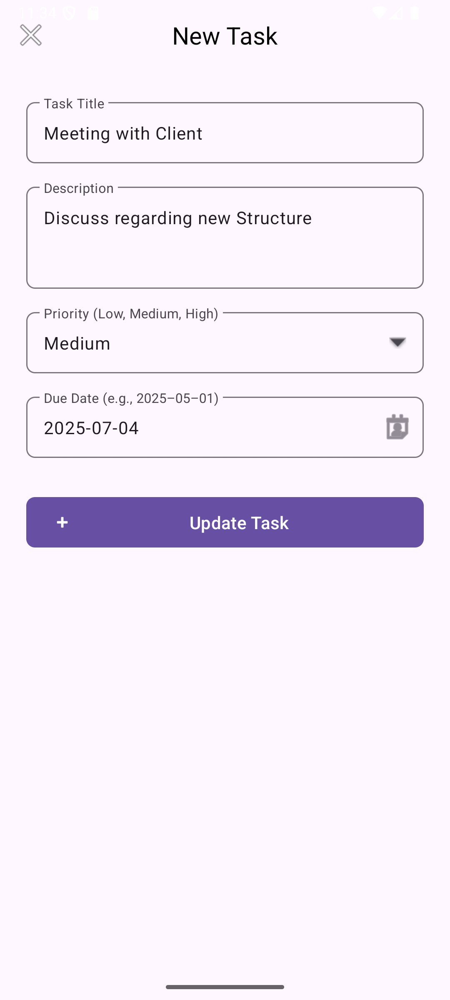
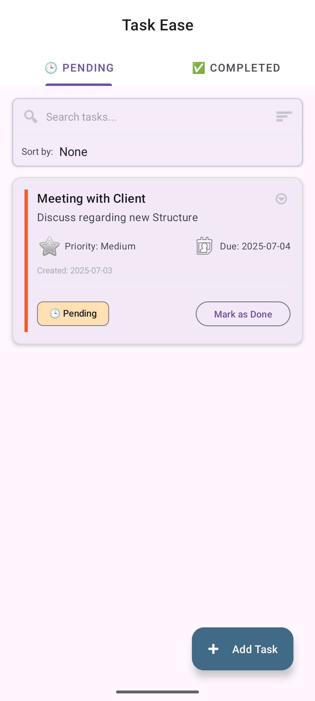
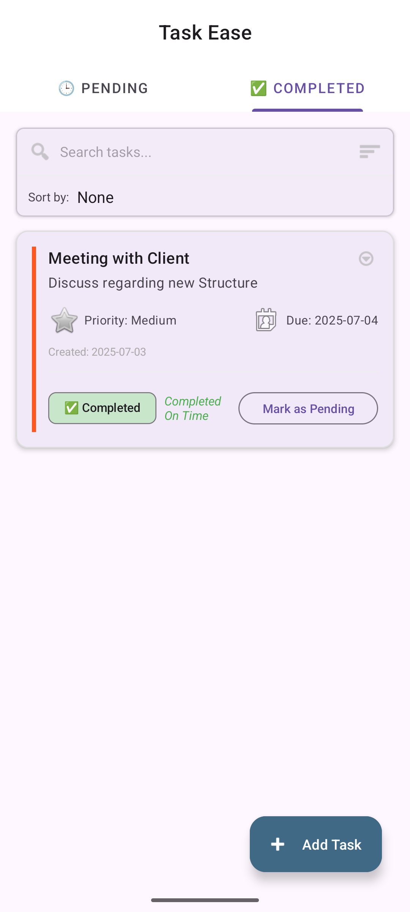
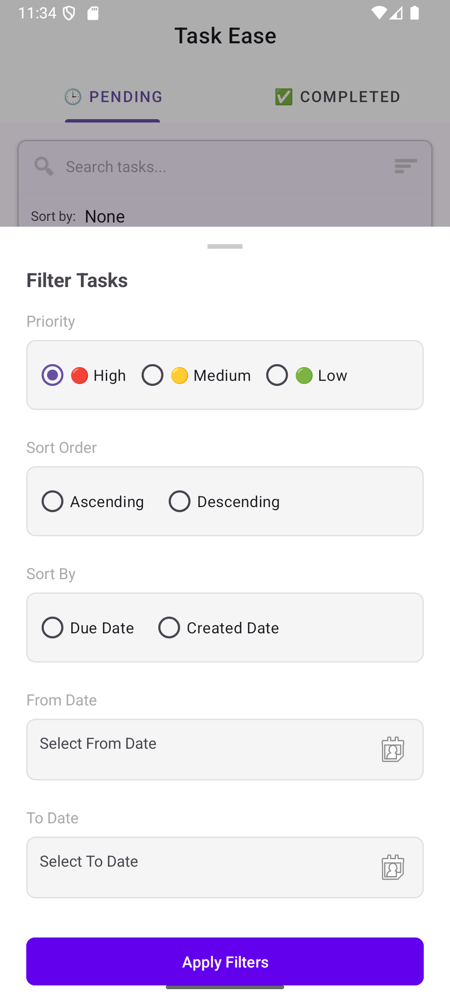

# TaskEase



TaskEase is a simple yet powerful Android task management app that helps users capture, organize, and track their to‑do items. Built with modern Android architecture and best practices, TaskEase offers an intuitive UI, local storage with Room, dependency injection with Hilt, and a clean MVVM setup.

---

## 🚀 Table of Contents

* [Features](#-features)
* [Screenshots](#-screenshots)
* [Architecture & Tech Stack](#-architecture--tech-stack)
* [Getting Started](#-getting-started)

  * [Prerequisites](#prerequisites)
  * [Installation](#installation)
* [Usage](#-usage)
* [Folder Structure](#-folder-structure)
* [Contributing](#-contributing)
* [License](#-license)

---

## 🎉 Features

* **Add & Manage Tasks**: Create tasks with title, description, due date, and priority.
* **Pending & Completed Tabs**: Toggle between Pending and Completed tasks with a single tap.
* **Filters & Sorting**: Filter by priority and search tasks by keyword.
* **Local Persistence**: All tasks are stored locally using Room Database.
* **Modern Architecture**: Follows MVVM, uses Hilt for DI, Kotlin Coroutines for async operations.
* **Responsive UI**: Material Components and Fragments for a smooth user experience.

---

## 📸 Screenshots

|           Add Task                               |                 Task List                         |                        Completed Task                    |                           Filter Task              |
| :-----------------------------------------------:| :-----------------------------------------------: | :------------------------------------------------------: |  :------------------------------------------------:|
|  |  |  |  | 

---

## 🏗 Architecture & Tech Stac

* **Language**: Kotlin
* **UI**: AndroidX, Material Components, Fragments
* **Arch**: MVVM (ViewModel + LiveData)
* **DI**: Hilt
* **Database**: Room
* **Async**: Kotlin Coroutines
* **Navigation**: Jetpack Navigation Component
* **Build**: Gradle Kotlin DSL

---

## 🛠 Getting Started

### Prerequisites

* Android Studio Flamingo (or newer)
* Android SDK 33+
* Gradle 7.4+

### Installation

1. **Clone the repo**

   ```bash
   git clone https://github.com/Puneet8Goyal/TaskEase.git
   cd TaskEase
   ```
2. **Open in Android Studio**

   * `File` → `Open…` → select the project root.
3. **Build & Run**

   * Let Gradle sync, then click **Run** on your device/emulator.

---

## ⚙️ Usage

1. On launch, you’ll see the splash screen.
2. Add a new task by tapping the “+” FAB.
3. Fill in details (title, due date, priority), then **Save**.
4. Switch between **Pending** and **Completed** tabs to track progress.
5. Use the filter icon to show only High/Medium/Low priority tasks.

---

## 📂 Folder Structure

```
app/                 # Android app module
├─ src/              # source sets
│  ├─ main/
│  │  ├─ java/com/example/mytaskmanager/   # ViewModels, Repos, DAOs, Models
│  │  ├─ res/                             # layouts, drawables, values
│  │  └─ AndroidManifest.xml              # app manifest
├─ build.gradle.kts  # module-level Gradle config
└─ ...

settings.gradle.kts  # root Gradle settings
```

---

## 🤝 Contributing

Contributions are welcome! Please open issues or pull requests for:

* Bug fixes
* Feature requests
* Doc improvements

1. Fork the repo
2. Create your feature branch (`git checkout -b feature/MyFeature`)
3. Commit your changes (`git commit -m 'Add MyFeature'`)
4. Push to the branch (`git push origin feature/MyFeature`)
5. Open a Pull Request

---

## 📄 License

This project is licensed under the MIT License. See the [LICENSE](LICENSE) file for details.
